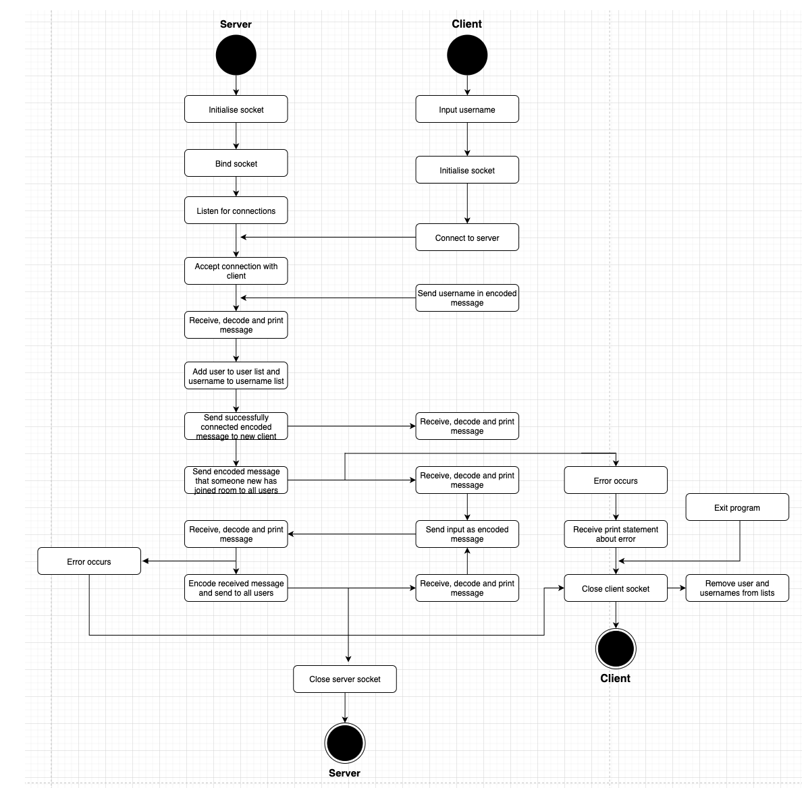

# 
T2A3 - Develop and Implement an Algorithm in Python

**1) Develop and describe an algorithmic solution for an application that utilises two way communication over a network (300 - 500 words).**

The program that has been created is a multi-user online chat room hosted on a server. Once a successful connection has been established between the server and client, the server will receive its first message from the user informing them of their chosen username. The server will then take this information and register the user to a list of all the current users and their username to the list of all current usernames. Whenever a new user joins the chat, the server will output to all users the new client’s username and that they have connected to the chat room. The new client is also issued a message from the server informing them they have successfully joined the chat. Following this process, users are able to communicate with another by sending messages to the server. When the server receives messages from a client, it relays the text to all users found in the user list. It is important to note that all communication is encoded to be in UTF-8 before it is sent to either the user or server and then is decoded on the receiving end of the message.

Both the server and client have socket classes which are used to connect to one another and communicate over the network. The classes contain the necessary properties and methods to establish a connection. The server has an additional class which handles client information and the receiving/sending of communications with clients. This class contains two list properties which store user information. The three functions in the class work in conjunction to both receive and transmit texts to users. In addition to these capacities, the functions also serve to accept multiple users and remove clients from the chat room if an error occurs or if they exit the program. The client has two additional classes, the first of which serves to transfer communication between the user and host. This process is achieved with two functions, one of which is dedicated to receiving, decoding and printing messages from the server. If an error does occur during this process then an exception will be raised and the user’s connection will be ceased. The second function encodes the user’s input before sending it as a message to the host. The client’s final class sets up two individual threads between the user and host, one for sending messages and another for receiving them.

The dependencies the algorithmic solution uses are the socket and threading modules. The socket module is used to connect multiple clients to the server. The use of sockets allows clients to talk to other users who are connected to the same host socket via communication with the server. Threading is integral to the solution as it allows each client to have their own individual threads with the server. These individual threads mean each user is able to independently connect to, receive and transmit messages with the server regardless of what any other client is doing.

** 2) Develop a flowchart for an application that outlines the control flow of the app, and illustrates the operation of an algorithm based on the solution you have described.**

